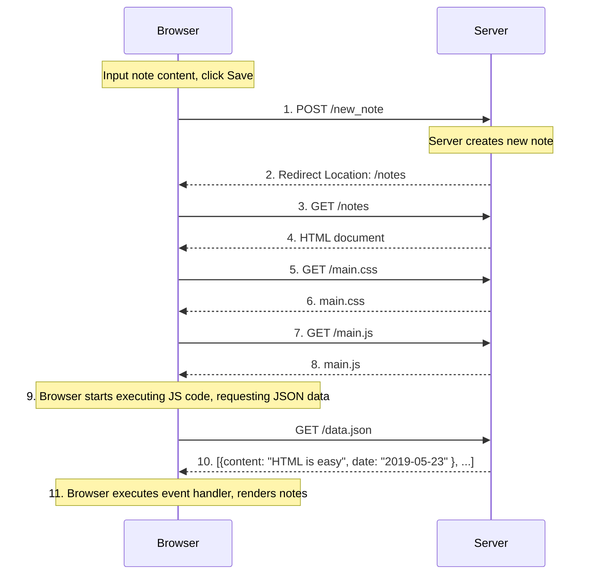

```mermaid
sequenceDiagram
    participant browser as Browser
    participant server as Server
    Note over browser: Input note content, click Save
    browser->>server: 1. POST /new_note
    Note over server: Server creates new note
    server-->>browser: 2. Redirect Location: /notes
    browser->>server: 3. GET /notes
    server-->>browser: 4. HTML document
    browser->>server: 5. GET /main.css
    server-->>browser: 6. main.css
    browser->>server: 7. GET /main.js
    server-->>browser: 8. main.js
    
    Note over browser: 9. Browser starts executing JS code, requesting JSON data
    browser->>server: GET /data.json
    server-->>browser: 10. [{content: "HTML is easy", date: "2019-05-23" }, ...]
    Note over browser: 11. Browser executes event handler, renders notes
```