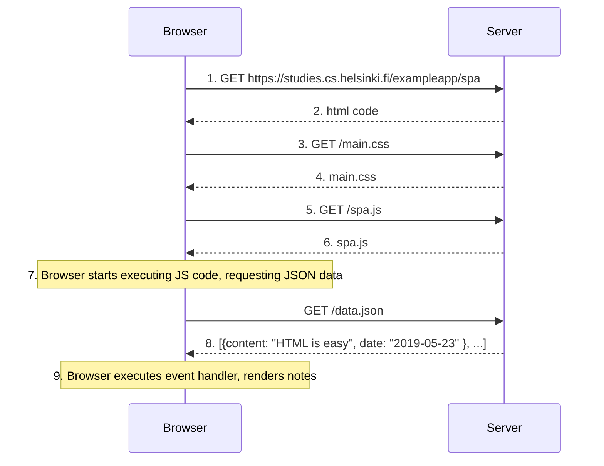

```mermaid
sequenceDiagram
    participant browser as Browser
    participant server as Server
    browser->>server: 1. GET https://studies.cs.helsinki.fi/exampleapp/spa
    server-->>browser: 2. html code
    browser->>server: 3. GET /main.css
    server-->>browser: 4. main.css
    browser->>server: 5. GET /spa.js
    server-->>browser: 6. spa.js
    Note over browser: 7. Browser starts executing JS code, requesting JSON data
    browser->>server: GET /data.json
    server-->>browser: 8. [{content: "HTML is easy", date: "2019-05-23" }, ...]
    Note over browser: 9. Browser executes event handler, renders notes
```